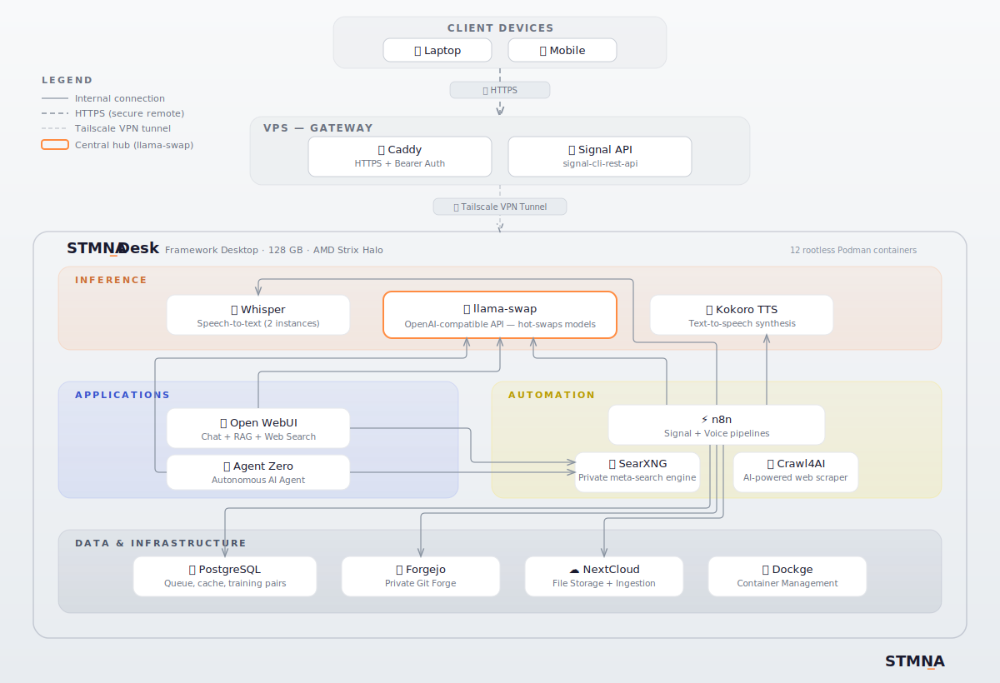

<div align="center">

  

  <br/>

  <p><em>Local inference, autonomous agents, content pipelines. All on hardware you own.</em></p>

[](LICENSE)
[](https://www.amd.com)
[](https://frame.work)
[](https://ubuntu.com)
[](https://podman.io)


  <br/>

  [🔧 What Runs on It](#what-runs-on-it) · [📖 Architecture](#architecture) · [⚡ Performance](#performance) · [🚀 Quick Start](#quick-start) · [📚 Guides](#guides) · [🔗 Ecosystem](#ecosystem)

</div>


---

## What is STMNA_Desk?

STMNA_Desk is a full self-hosted AI stack running on a Framework Desktop with 128GB unified memory (AMD Ryzen AI Max+ 395). It runs state-of-the-art open-source LLMs locally, autonomous AI agents, speech-to-text and content ingestion pipelines, cloud storage, and a chat interface with RAG over your own documents. Everything runs simultaneously, hardened and production-stable in rootless containers on Ubuntu 24.04 LTS.

The stack is live, accessible remotely, and provides a single OpenAI-compatible API serving inference to every other service. Every architectural decision has been tested and documented with rationale in [`/docs/`](docs/). What runs on it is below.

---

## What Runs on It

🧠 **Local LLM Inference**  Run state-of-the-art open-weight models like Qwen3.5-35B and 122B locally and always-warm lightweight models for low-latency tasks like speech-to-text correction. (llama-swap, llama.cpp, Vulkan)

🗨️ **Interactive Chat with RAG**  Ask questions, search the web, and query your own documents through a local chat interface with retrieval-augmented generation. (Open WebUI, SearXNG)

📥 **Content Ingestion + 🔊 Audio Summaries**  Send a YouTube video, a URL, or a full book via Signal messenger or Nextcloud and get a structured summary in your vault with a voice memo version. Handles summarization, translation (full ebooks!) and TTS. ([STMNA_Signal](https://github.com/stmna-io/stmna-signal))

🎙️ **Self-Improving Speech-to-Text**  Push-to-talk dictation from Linux or Android with Whisper transcription, LLM-powered correction, and automatic training pair collection for fine-tuning. ([STMNA_Voice](https://github.com/stmna-io/stmna-voice))

🤖 **Autonomous AI Agents**  Run Agent Zero against local inference with full web access for deep research, content scraping, and recurring scheduled tasks. Set up proactive monitoring jobs, automated report generation, and multi-step problem solving with no API costs. (Agent Zero)

⚡ **Workflow Automation**  Chain LLM calls, web scraping, and database writes into automated pipelines. This is the orchestration layer that powers STMNA_Signal and STMNA_Voice behind the scenes. (n8n, Crawl4AI, PostgreSQL)

🏠 **Self-Hosted Infrastructure**  Private git forge with full version history for your notes, configs, and code. Sovereign cloud storage that doubles as an ingestion endpoint for STMNA_Signal. No third-party accounts required. (Forgejo, Nextcloud)

---

## Architecture



> *The diagram shows the recommended production topology, where externally-reachable services (reverse proxy, Signal API) run on a separate VPS for security isolation and availability. The compose files in this repo deploy all services to a single host for simplicity (see [Remote Access](docs/remote-access.md) for the split-host approach.)*


| Service | Port | Purpose |
|---------|------|---------|
| llama-swap | 8081 | Model hot-swap proxy, OpenAI-compatible API |
| Open WebUI | 3000 | Chat interface with RAG and web search |
| PostgreSQL | 5432 | Pipeline queue, cache, training pairs |
| Dockge | 5001 | Container management UI |
| n8n | 5678 | Workflow automation (custom image) |
| whisper.cpp | 8083, 8084 | Speech-to-text, separate Voice and Signal instances |
| Kokoro TTS | 9005 | Text-to-speech synthesis |
| SearXNG | 8888 | Self-hosted meta-search |
| Crawl4AI | 11235 | Web scraping |
| Agent Zero | 50001 | Autonomous AI agent |
| Forgejo | 3300 | Self-hosted git forge |
| Nextcloud | 8090 | Sovereign cloud storage and ingestion endpoint |

All containers run rootless under a non-privileged user. Day-to-day operations require no `sudo`.

See [Architecture](docs/architecture.md) and [Remote Access](docs/remote-access.md) for more details.

---

## Hardware

| Component | Specification |
|-----------|---------------|
| **CPU/APU** | AMD Ryzen AI Max+ 395 (Strix Halo) |
| **Unified Memory** | 128GB (96GB allocatable to GPU under Linux) |
| **Storage** | 2TB NVMe SSD |
| **Form Factor** | Framework Desktop DIY Edition |
| **OS** | Ubuntu 24.04 LTS |

The 128GB unified pool is what makes this class of hardware interesting for AI workloads. Qwen3.5-122B loads in full at Q4 quantization (68.4GB) with room left for concurrent models, services, and 65K+ token context windows. Multiple models stay warm simultaneously: daily driver, voice correction model, and whisper all share the same memory pool without swapping. The Vulkan GPU runs llama.cpp and whisper.cpp natively without any CUDA dependency.

For a detailed hardware breakdown with comparisons across DGX Spark, Mac Studio, and discrete GPU options, plus driver notes and power monitoring: [Hardware Guide](docs/hardware-guide.md)

---

## Performance

Benchmarked on Radeon 8060S (gfx1151), Vulkan, llama.cpp build b8182.

| Model | Quant | Speed | Best for |
|-------|-------|-------|----------|
| Qwen3.5-122B-A10B | Q4_K_XL | 24 t/s | High-quality reasoning |
| Qwen3.5-35B-A3B | Q6_K_XL | 29 t/s | Interactive chat, tool calling, agentic tasks |
| Qwen3-30B-Instruct-2507 | Q6_K_XL | 66 t/s | Always-on daily driver, Signal pipeline |
| GLM-4.7-Flash | Q6_K | 58 t/s | Fast agentic tasks |
| whisper large-v3-turbo | Q5 | ~3-4 GB VRAM | Speech-to-text (Vulkan) |

Qwen3-30B-Instruct at 66 t/s is the right model for always-on and batch pipeline work. Qwen3.5-35B runs at 29 t/s on the current production build, with 32+ t/s already validated on newer llama.cpp builds as Vulkan shader support for this architecture matures. The quality and tool-calling capabilities of Qwen3.5 justify the speed trade-off for interactive and agentic use. Model selection, benchmarks, and upstream PRs to watch are documented in [Inference Stack](docs/inference-stack.md).

---

## Quick Start

> Full base system setup: [Install Guide](docs/install-guide.md)

**Prerequisites:** Framework Desktop 128GB (or equivalent AMD Strix Halo system), Ubuntu 24.04 LTS, Podman installed (rootless).

```bash
git clone https://github.com/stmna-io/stmna-desk.git
cd stmna-desk
```

The `stacks/` directory has individual compose files for every service, each with inline configuration comments. Start with the [Install Guide](docs/install-guide.md) for base system setup (drivers, GPU memory, Podman), then deploy services using the compose files. The [stacks README](stacks/README.md) has the recommended deployment order.


---

## 📚 Guides

| Guide | What's in it |
|-------|-------------|
| [Install Guide](docs/install-guide.md) | Ubuntu 24.04 on Strix Halo, GPU memory configuration, Vulkan setup, rootless Podman |
| [Hardware Guide](docs/hardware-guide.md) | Framework Desktop specs, DGX Spark / Mac Studio / discrete GPU comparisons, cost analysis, power and thermals |
| [Inference Stack](docs/inference-stack.md) | Model inventory, benchmark data, Vulkan vs ROCm decision, Qwen3.5 speed situation |
| [Service Deployment](stacks/README.md) | Reference compose files for every service running on STMNA_Desk |
| [Architecture](docs/architecture.md) | System layers, n8n orchestration rationale, rootless Podman, container networking |
| [Remote Access](docs/remote-access.md) | Options for exposing services over HTTPS |


---

## 🔗 Ecosystem

| Product | Description | Repo |
|---------|-------------|------|
| **STMNA_Signal** | Content ingestion + AI processing pipeline (YouTube, web, ebooks, voice notes) | [stmna-signal](https://github.com/stmna-io/stmna-signal) |
| **STMNA_Voice** | Self-improving push-to-talk speech-to-text pipeline | [stmna-voice](https://github.com/stmna-io/stmna-voice) |
| **STMNA_Voice Mobile** | Sovereign push-to-talk voice input for Android | [stmna-voice-mobile](https://github.com/stmna-io/stmna-voice-mobile) |

---

## Acknowledgments

STMNA_Desk runs because of the work these projects put in:

- [llama.cpp](https://github.com/ggerganov/llama.cpp) by Georgi Gerganov for local inference
- [whisper.cpp](https://github.com/ggerganov/whisper.cpp) by Georgi Gerganov for speech recognition on AMD
- [llama-swap](https://github.com/mostlygeek/llama-swap) by mostlygeek for model hot-swapping
- [n8n](https://n8n.io) for visual workflow automation
- [Podman](https://podman.io) for rootless containers
- [Open WebUI](https://github.com/open-webui/open-webui)  for the chat interface
- [SearXNG](https://github.com/searxng/searxng) for self-hosted meta-search
- [Crawl4AI](https://github.com/unclecode/crawl4ai) for web scraping
- [Framework](https://frame.work) for repairable hardware worth keeping
- [kyuz0](https://github.com/kyuz0) for early inference container work on this architecture 
- [technigmaai](https://github.com/technigmaai/technigmaai-wiki) for the Strix Halo GTT memory configuration guide
- The whole Strix Halo community

---

## Contributing

The most useful contribution right now is benchmark data on non-Framework AMD Strix Halo hardware. If you run this stack on a different board or APU, open an issue with your speeds and configuration.

Also welcome: documentation improvements, bug reports with hardware and OS details, and new service compose files for the `stacks/` directory.

See [CONTRIBUTING.md](CONTRIBUTING.md) for guidelines.

---

## License

Apache 2.0 (see [LICENSE](LICENSE))

---

<div align="center">
  <sub>Built by <a href="https://github.com/stmna-io">STMNA_</a> · Engineered resilience. Sovereign by design.</sub>
</div>
